# 📱 SamefostBrwon

A modern, feature-rich Flutter application built to provide smooth user experience with authentication, journaling, subscription, AI-powered charts, and more.  

---

## 👨‍💻 Developer Info
- **Developer**: MST Khushi Akter  
- **Role**: Flutter Developer  
- **Company**: Softvence Agency, Betopia Group  

---

## ✨ Features

### 🔐 Authentication
- Sign In / Sign Up  
- OTP Verification  
- Update / Reset Password  

### 🏠 Home
- Clean and modern dashboard design  
- Subscription screen  
- Journal screen  
- Manual Journal screen  

### 🤖 AI Features
- AI Chart Screen  
- AI Generate Screen  

### 🎨 Design
- Built with Flutter (Dart) in **Android Studio**  
- Inspired from modern UI/UX principles  
- Figma design file available  

🔗 **Figma Design Link**  
[View on Figma](https://www.figma.com/design/8TNjGqKs6NKL9dEoc2IfQ0/Samfosterbrown-%7C%7C-Swiftech-%7C%7C-FO71AB7CA9781?node-id=0-1&p=f&m=dev)

---

## 📷 Screenshots  

<div style="overflow-x: auto; white-space: nowrap;">


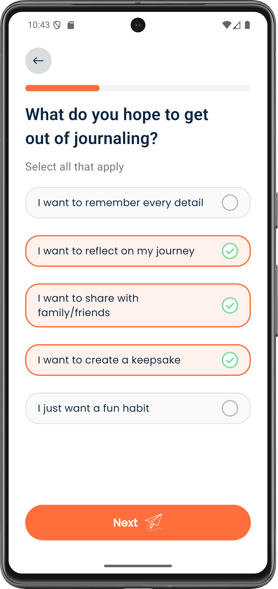
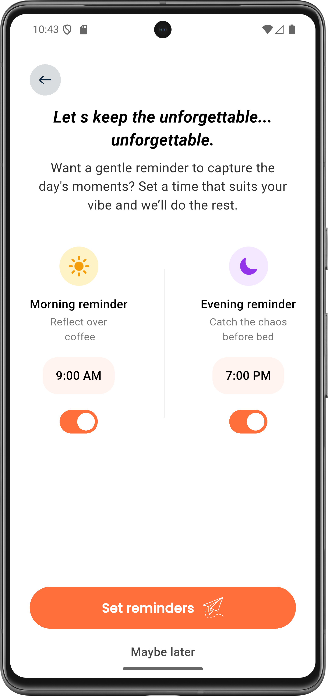
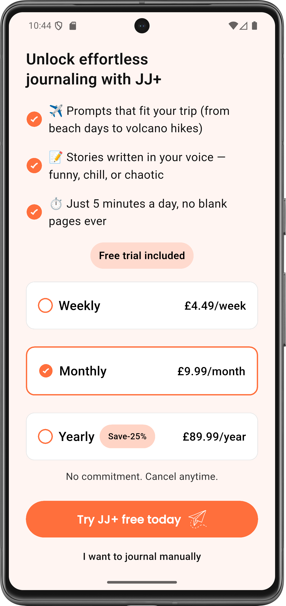
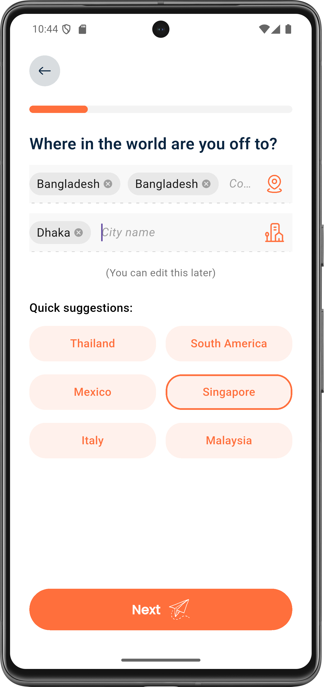
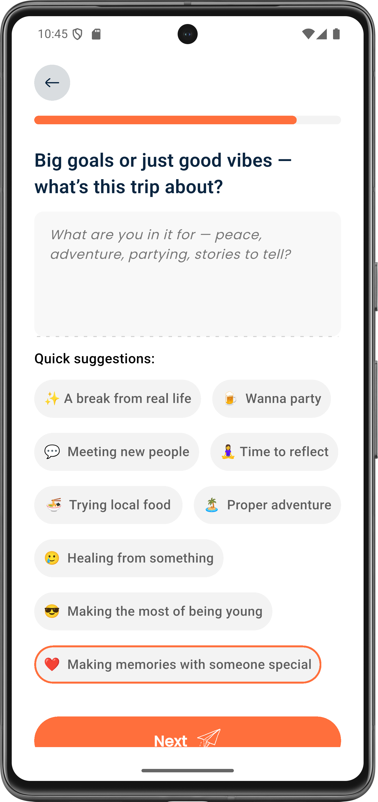
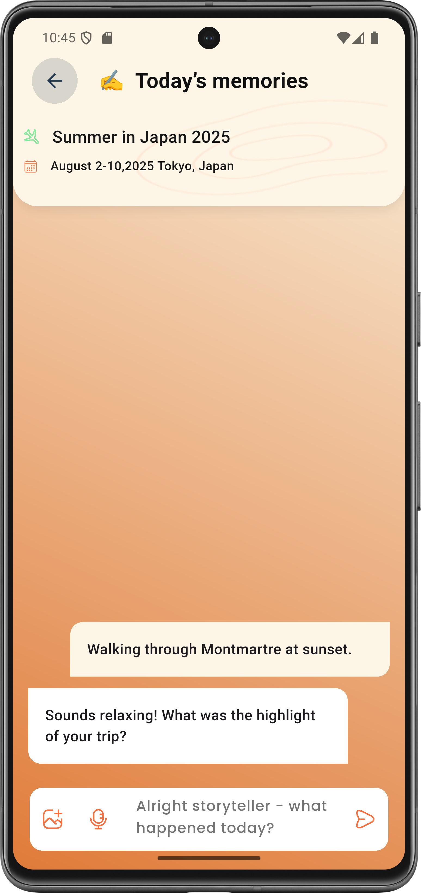
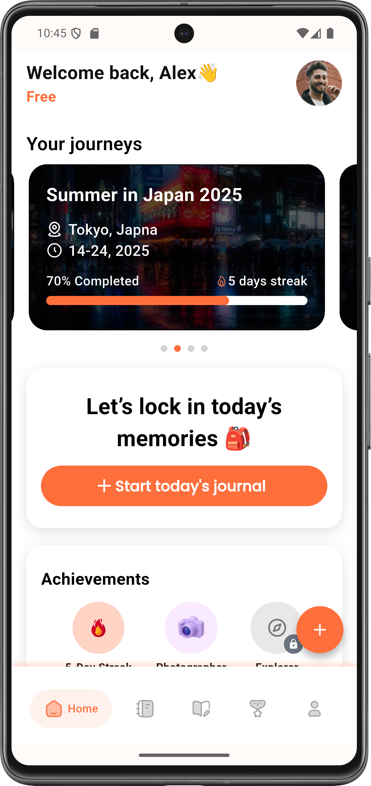
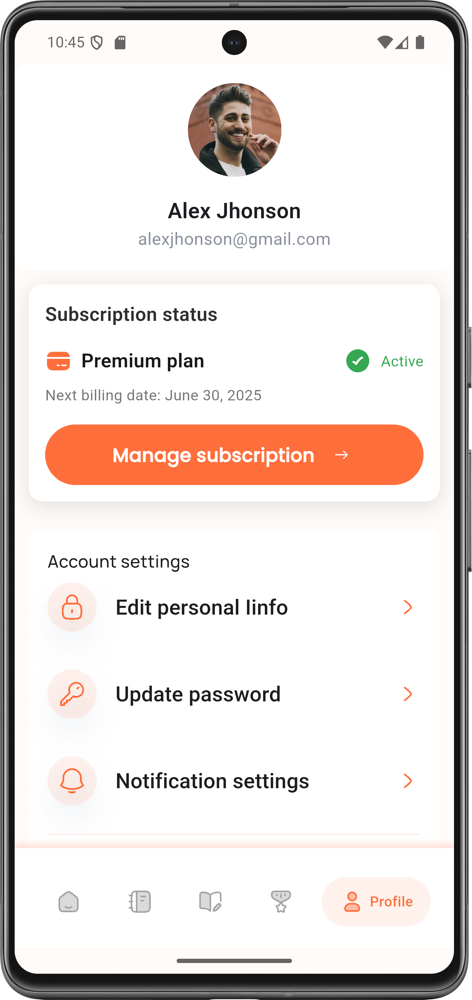
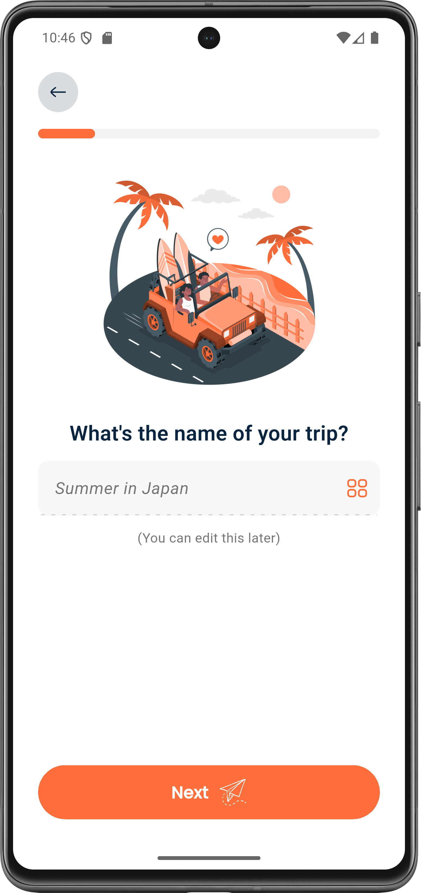
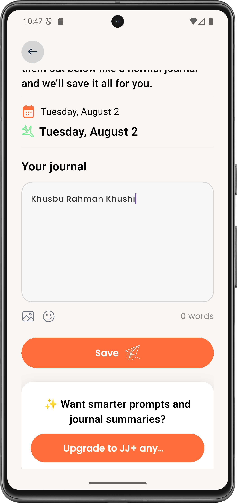
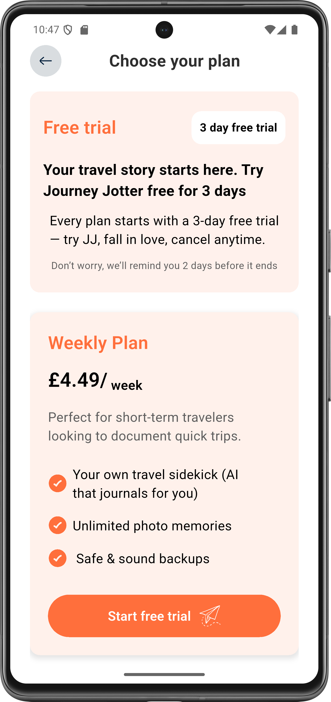

</div>

---

## 🛠 Tech Stack
- **Flutter** – Cross-platform mobile development  
- **Dart** – Programming language  
- **Android Studio** – Development environment  

---

## 🚀 Getting Started

Follow these steps to run the project locally:

```bash
# Clone the repository
git clone https://github.com/your-username/samefostbrwon.git
cd samefostbrwon

# Install dependencies
flutter pub get

# Run the app
flutter run
